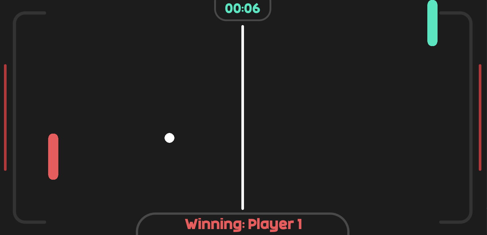
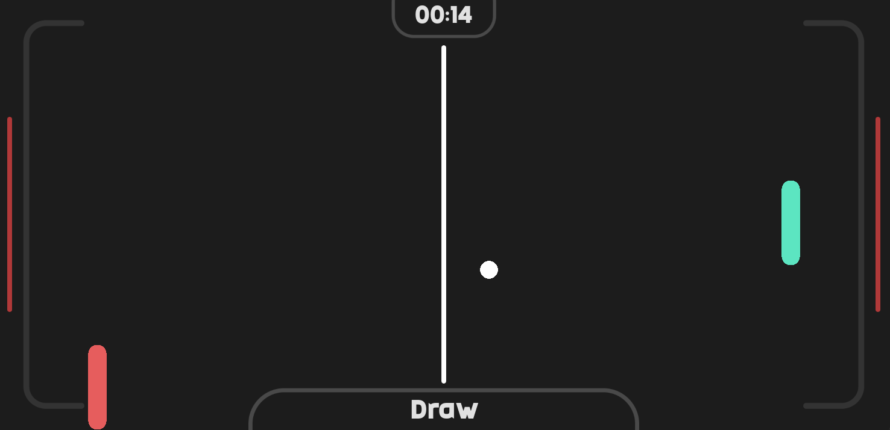

# Pong Game using Pygame

## Introduction

This project implements the classic Pong game using Python and the Pygame library. Pong is a simple 2D sports game that simulates table tennis. Players control paddles and try to hit a ball back and forth across the screen. The goal is to score points by making the opponent miss the ball.

## Screenshots
<p align="center">
  
</p><p align="center">
  
</p>

## Requirements

- Python 3.x
- Pygame library

## Installation

1. **Install Python:** If you haven't already, download and install Python from the [official website](https://www.python.org/).

2. **Install Pygame:**
```bash
pip install pygame
```

## Usage

1. Clone the repository or download the source code.

2. Navigate to the project directory.

3. Run the following command:
```bash
python main.py
```

4. Enjoy playing Pong!

## Controls

__How to play?__

Player |     Keys    | Moviment
------ | ----------- | --------
One    |      W      |    Up
One    |      S      |   Down
Two    |  Up arrow   |    Up
Two    |  Down arrow |   Down
## Features

- Two-player mode: Play against a friend.
- Simple controls: Control paddles using keyboard keys.
- Classic gameplay: Experience the nostalgia of the original Pong game.

## Acknowledgements

This project was created using the Pygame library, which provides an easy-to-use framework for game development in Python.

## Credits

- [Pygame Documentation](https://www.pygame.org/docs/): Official documentation for Pygame library.

- [Pong - Wikipedia](https://en.wikipedia.org/wiki/Pong): Learn more about the history and gameplay of Pong.
